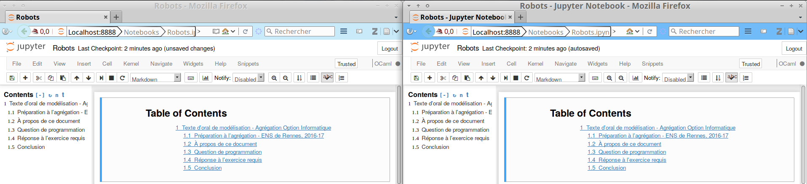
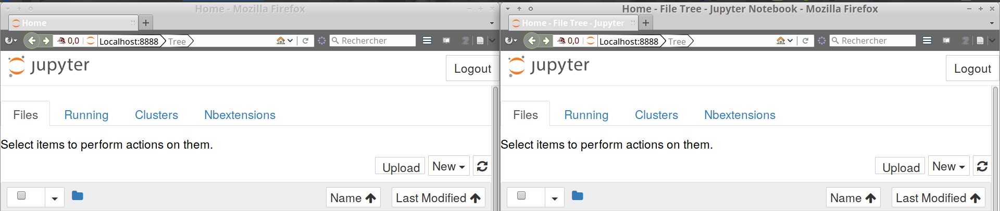
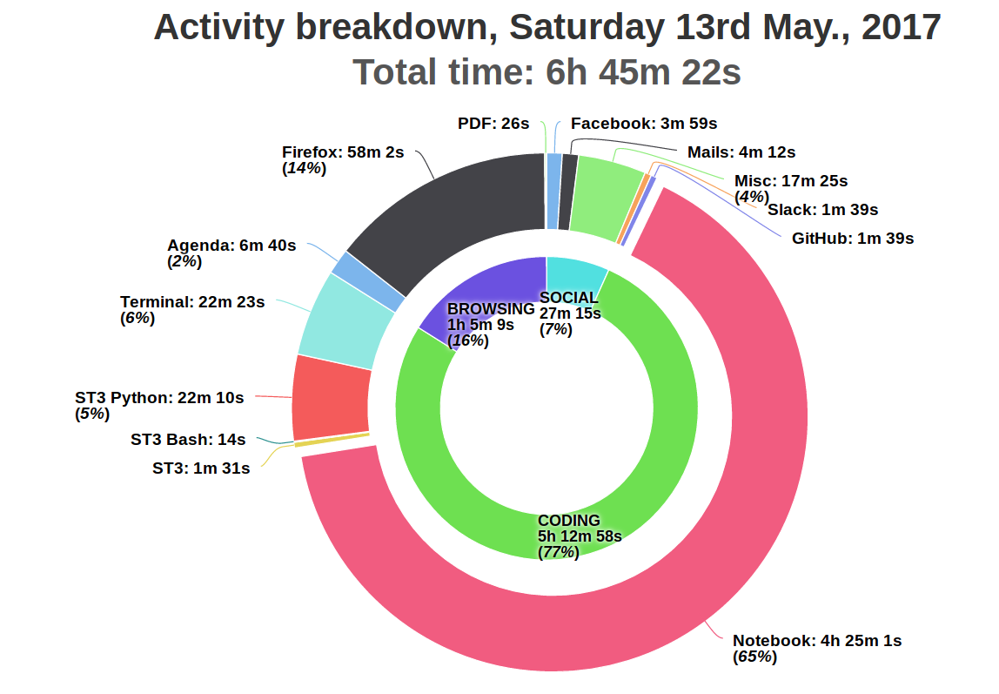

# "How to customize [Jupyter notebooks](https://www.Jupyter.org/) document titles ?"

> This small document is here to *quickly* and *clearly* explain how to do the following tweak for *every* page that the [Jupyter](https://www.Jupyter.org/) application displays in your browser :
>
> >  « How to ensure that the title of the web page (`document.title` in the DOM) finishes with `" - Jupyter Notebook"` ? »
>
> These explanations were up-to date on May 12th of 2017, with [Jupyter Notebook](https://github.com/jupyter/notebook/) package at  [version 5.0.0](https://github.com/jupyter/notebook/releases/tag/5.0.0).

----

The following explanations assume you have a local installation of Jupyter Notebook. If this is not the case, [follow this tutorial](https://jupyter.readthedocs.io/en/latest/install.html).

Typically, this Python package will be installed in `/usr/local/lib/python3.5/dist-packages/notebook/` on a Debian/Ubuntu machine, and probably on a similar location for Mac OS X, and you can figure it out on Windows. Let call that path `PATH/`.

## First modification : HTML templates

- Go in `PATH/templates/`
- Edit, probably with `sudo` rights, the following templates:
- + `view.html` on line #6, add "`- File View`" after `{{page_title}}` and before `</title>`.
  + `tree.html` on line #3, add "`- File Tree`" after `{{page_title}}` and before `{` `%` `endblock` `%` `}`.
  + `terminal.html` on line #3, add "`- Terminal`" after `{{page_title}}` and before `{` `%` `endblock` `%` `}`.
  + `edit.html` on line #3, add "`- Editor`" after `{{page_title}}` and before `{` `%` `endblock` `%` `}`.
  + `page.html` on line #7, add "` - Jupyter Notebook`" after `{` `%` `endblock` `%` `}` and before `</title>`.
- Be sure to save all the changes, and that's it for this step.

> Of course, if the line number don't match, just search for the pattern, and edit on the first line that contains it !

## Second modification : Javascript files

- Go in `PATH/notebook/static/notebook/js/`
- Edit, probably with `sudo` rights, the following scripts:
- + `main.min.js ` (and maybe `main.js`) : on line #32216 (or nearby!), add "` + ' - Jupyter Notebook'`" after "`document.title = nbname`"...  :warning: that file is HUGE, so try to use a solid text editor to edit it! (for instance, [GNU nano](https://www.nano-editor.org/))
  + `savewidgets.js` : on line #139, add "` + ' - Jupyter Notebook'`" after "`document.title = nbname`"

## Cautious!
These changes **have to be done** again if you update (`pip install --upgrade`) Jupyter Notebook...

----

## Demos ?
Here are some screenshots showing that these small modifications worked:

### Editing a notebook : before and after

### Home view : before and after

----

> You can also [see the useless PDF version of this webpage](How-to-customize-title-of-jupyter-notebook.pdf)... If you want!

## Questions

### Bonus question : *why would you want to do **that** ?*

- Simple and honest answer : I am constantly using my [uLogMe](https://github.com/Naereen/uLogMe/) software to watch and monitor the *title* of the active window on my laptops, and I wanted to store the time spent editing Jupyter notebooks under a special category ("Notebooks") and not under the general browsing time.

  

- Fun answer : ... I am always curious about how a certain piece of software works, and I love tweaking "just a little bit" open-source pieces of code!

### Interesting question : *why writing a tutorial and not a Jupyter Notebook extension (`nbextension`) ?*

- Simple answer : I think (or though) it would be hard, as the changes explained below concern just a line or two in a few files, but on the core files of the software...
- Boring answer : I don't have time to produce a well-done nb extension, and maintain it...

----

## :scroll: License ? 
[MIT Licensed](https://lbesson.mit-license.org/) (file [LICENSE](LICENSE)).
© [Lilian Besson](https://GitHub.com/Naereen), 2017.

